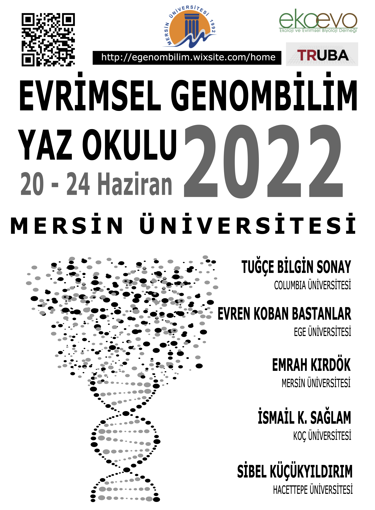

Geleneksel hale gelmiş etkinlikler, akademik kültürün verimli bir şekilde aktarılması açısından oldukça önemli bir yer tutuyor. Bu sayede, belli bir alanda çalışan araştırmacılar ara sıra bir araya gelerek yeni yöntemleri, en güncel bilgileri, ve güncel çalışmalarını paylaşıyorlar. Ne güzel ki ülkemizde de artık geleneksel hale gelmiş bir çok etkinlik var ve bu etkinliklerden bir tanesi de [Tuğçe Bilgin Sonay](https://tugcebilgin.net) ve [Sibel Küçükyıldırım Çelik](https://avesis.hacettepe.edu.tr/sibel.kucukyildirim) tarafından organize edilen evrimsel genombilim uygulamalı eğitim serisi.

Tuğçe ve Sibel her yıl Türkiye'nin farklı şehirlerinde bu etkinlikleri organize ediyor ve lisansüstü seviyede araştırma yapan genç bilim insanlarını, biyoinformatik disiplininin evrimsel biyoloji alanında en güncel uygulamaları hakkında bilgilendirmeye çalışyor.

Daha önce 2020 yılı başında, Ege Üniversitesinde [Evren Koban Baştanlar](https://avesis.ege.edu.tr/evren.koban.bastanlar/) ev sahipliğinde yapılan etkinliğe katılma fırsatı bulmuş ve metagenomik alanındaki bilgilerimi aktarmıştım.

Daha sonra bu etkinliği Mersin Üniversitesinde düzenleme fikri ortaya çıktı ancak pandemi buna engel oldu ve geçen yıl çevrimiçi bir etkinlik düzenlemek durumunda kaldık...

Sonunda bu hayali gerçekleştiriyoruz! :)

Hepinizi 20 - 24 Haziran 2022'de Mersin Üniversitesi, Biyoteknoloji bölümünde düzenlenecek olan Evrimsel Genombilim yaz okulu etkinliğimize bekliyoruz. Etkinliğimizin internet sitesini ziyaret ederseniz daha ayrıntılı bilgiler alabilirsiniz:

[https://egenombilim.wixsite.com/home](https://egenombilim.wixsite.com/home)

